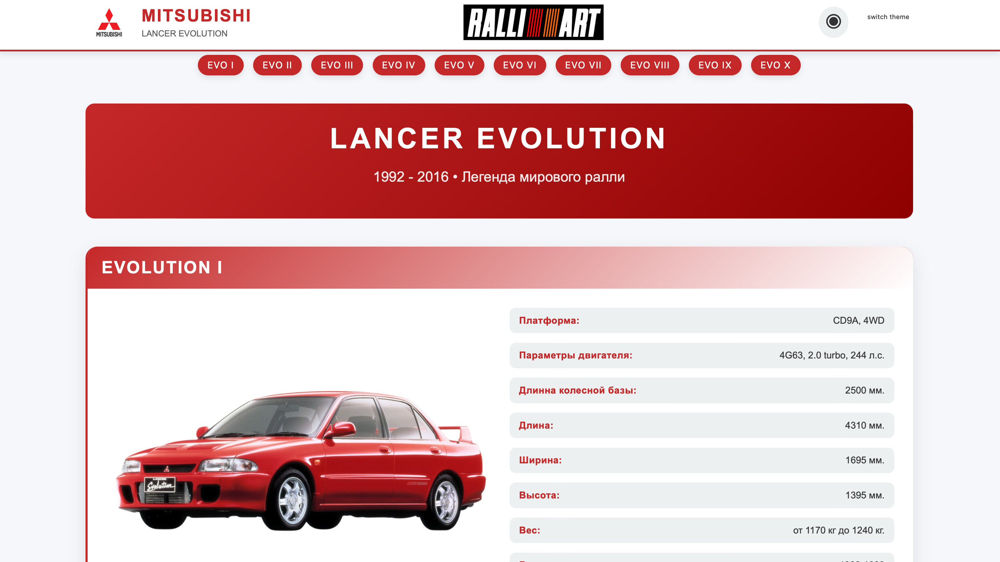
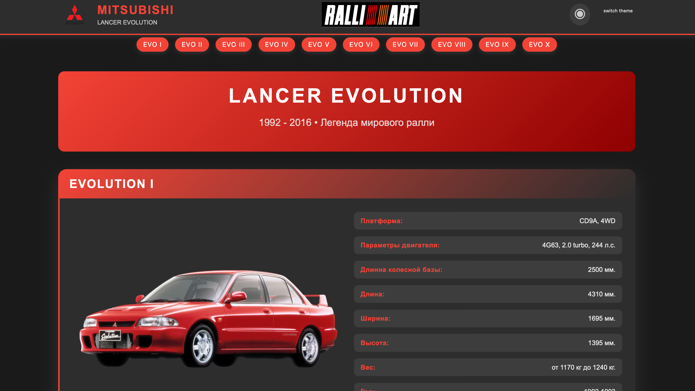
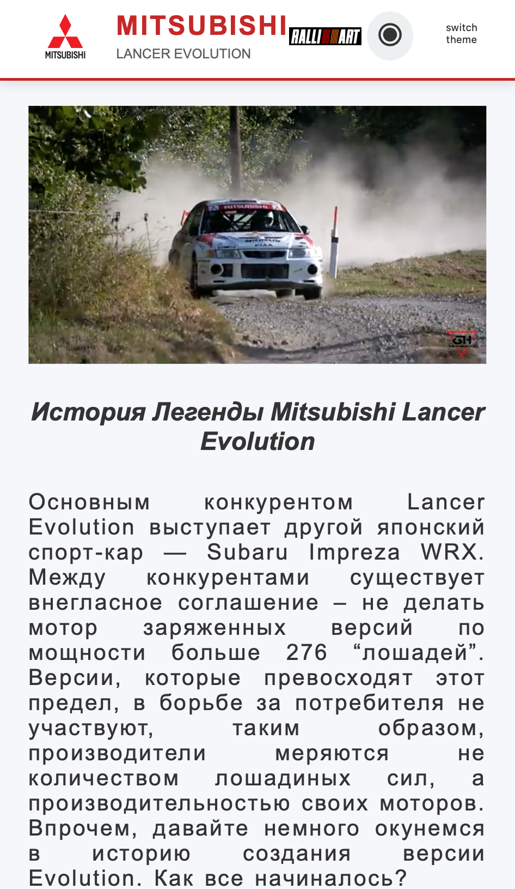
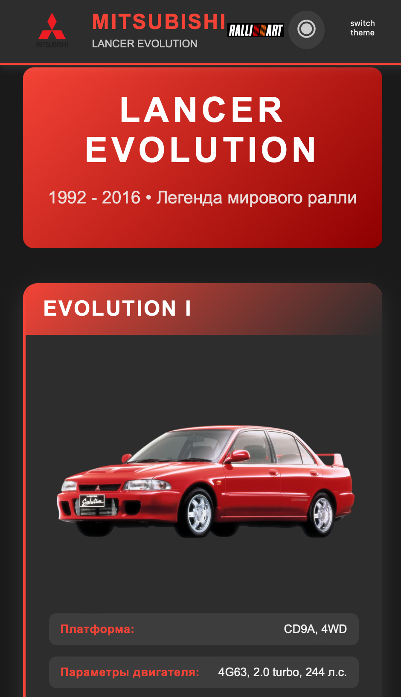

# 🏁 Lan-evo-history — Лонгрид об истории Mitsubishi Lancer Evolution

Учебный командный проект — интерактивный лонгрид, посвящённый истории десяти поколений культового японского спортивного автомобиля Mitsubishi Lancer Evolution (1992–2016). Одностраничник с плавной навигацией по эпохам, переключением темы и динамической генерацией контента через JavaScript-шаблоны.

---

## 📸 Превью

| Светлая тема | Тёмная тема |
|:---:|:---:|
|  |  |
|:---:|:---:|
|  |  |
---

## 📋 Структура и функционал

### 1. Шапка сайта (Header)
Фиксированная шапка с логотипом Mitsubishi, названием сайта и логотипом гоночного RalliArt. Содержит кнопку переключения темы оформления.

### 2. Переключатель темы (Dark / Light Mode)
Реализован через toggle CSS-класса на `body`. Все цвета интерфейса (фон, текст, акценты, тени, карточки) построены на CSS-переменных (`:root`), что позволяет мгновенно перекрашивать весь сайт одной командой без перерендера.

### 3. Введение
Вводный блок с историческим экскурсом в создание модели, автоматически воспроизводимым фоновым видео с раллийного этапа (Evo VI) и изображением от RalliArt.

### 4. Панель навигации по поколениям
Горизонтальная лента из 10 кнопок (EVO I — EVO X). Каждая кнопка активирует плавную анимированную прокрутку к соответствующей секции поколения на странице. Реализована навигация внутри одностраничника без хеш-роутинга и перезагрузки.

### 5. Секции поколений
Основное тело лонгрида — 10 идентичных по структуре блоков, посвящённых каждому поколению Evolution:
- Историческое описание поколения (текстовый контент).
- Динамически сгенерированная карточка технических характеристик.

### 6. Динамическая генерация карточек (Core JS Feature)
Информация о каждом поколении не захардкожена в HTML, а генерируется через JavaScript:
- В HTML определён единый шаблон карточки (`<template id="card-template">`).
- Функция `createCard()` клонирует этот шаблон и заполняет его данными (платформа, двигатель, колёсная база, длина, ширина, высота, вес, год, изображение).
- Готовая карточка внедряется в соответствующий контейнер-плейсхолдер (`#placeholder1` — `#placeholder10`).

Данный подход позволил избежать дублирования разметки и упростить масштабирование — для добавления новой карточки достаточно одного вызова функции.

### 7. Карточка характеристик
Каждая карточка содержит:
- **Заголовок** поколения с градиентной подложкой.
- **Изображение** автомобиля эффектом масштабирования.
- **Таблицу параметров** (платформа, двигатель, размеры, вес, год выпуска)

### 8. Футер
Копирайт, слоган проекта и перечень авторов команды.

---

## 🛠 Стек технологий

| Категория | Технологии |
|---|---|
| **Разметка** | HTML5|
| **Стилизация** | CSS3 / SCSS (CSS Variables, Flexbox, Nested selectors, Media Queries) |
| **Логика** | Vanilla JavaScript (ES6+), jQuery 3.7.1 |
| **Шрифты** | Google Fonts  |
| **Медиа** | HTML5 Video |

---

## ⚙️ Технические особенности

**Темизация через CSS Variables.** Все цветовые схемы (светлая и тёмная) построены на переменных в `:root` и `.dark-mode`. Переключение темы происходит мгновенно через toggle одного класса на `body`, без пересчёта стилей отдельных элементов. Даже фильтр иконок реализован через переменную `--invert`, что автоматически инвертирует SVG под текущую тему.

**Шаблонизация без фреймворков.** Использование нативного HTML-тега `<template>` в связке с `cloneNode()` позволило реализовать «поколение — данные — карточка» без React или Vue. Это показывает понимание работы с DOM на низком уровне.

**Плавная навигация через jQuery.** Переходы между секциями реализованы через `$('html,body').animate({ scrollTop: ... }, 1300)`, что даёт плавную прокрутку с настраиваемой длительностью — важный UX-элемент для длинных лонгридов.

**SCSS-подобная вложенность.** Стили написаны с использованием вложенных селекторов (`&:hover`, `&:nth-child()`), что улучшает читаемость и поддержку кода при работе в команде.

**Адаптивная сетка карточек.** Внутри `.card-content` используется `flex-wrap: wrap` с базисом `flex: 1 1 300px` — карточки автоматически перестраиваются с горизонтального макета (десктоп) на вертикальный (мобильные устройства) без отдельных медиа-запросов.

---

## 👥 Команда

Проект выполнен в рамках учебной работы командой из четырёх человек. Реализация построена на разделении зон ответственности и последующей интеграции модулей.

| Роль | Имя | Зона ответственности |
|---|---|---|
| **Team Lead / Frontend** | Рустам | Координация команды, распределение задач, решение возникающих проблем, доработка стилей, code review |
- Telegram: @Adrenalin161
- Почта: rustambabaev161@gmail.com

| **Frontend** | Герман | Вёрстка секций поколений, разработка дизайна, работа с медиа-контентом, создание логики работы шаблонов карточек, поиск и структуризация информации, разработка базовой структуры страницы |
|---|---|---|
- Telegram: t.me/papugator
- Почта: skylinear228@gmail.com
- GitHub: https:/github.com/Papugator

| **Frontend** | Соня | Вёрстка секций поколений, разработка дизайна, поиск и структуризация информации, работа со стилями и анимацией, автор идеи основной структуры |
|---|---|---|
- Telegram: @sonia.zoteeva
- GitHub: https:/github.com/SofiAS1221

| **UI/UX дизайн** | Альбина | Проектирование визуальной концепции лонгрида, дизайн-система, типографика |
|---|---|---|
- Telegram: @AlbinaTsvet
- Почта: alina_tsvetkova_84@bk.ru

---

## 🚀 Запуск проекта локально

Проект написан на нативных технологиях без использования сборщиков

**1. Клонировать репозиторий:**
```
git clone https://github.com/Rusta-16/Lan-evo-history.git
```

**2. Перейти в директорию проекта:**
```
cd Lan-evo-history
```
**3. Открыть файл index.html**